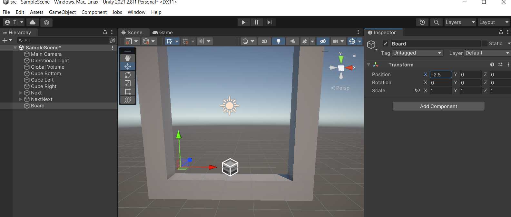

# 概要
今回は仮想的なゲーム画面を導入します。
ゲームを処理するときは、3次元のワールド空間で
直接、計算処理を行うわけではなく、
モデル化されたゲームの世界で計算を行うことが多いです。
今回は「ボード」という概念を導入して、
ボードにぷよを置くと、ワールド空間で表示
されるようにしてみましょう。

# 手順

## ゲームオブジェクトを追加する
- gameObject「Board」を作成
  - 「Create Empty」でオブジェクトを生成
  - オブジェクトの位置を(0,0)の位置に
  ぷよを置いたときに表示される位置に移動
    - 具体的には(-2.5, 0, 0)

## 1P に関係するオブジェクトを Board の子にする
対戦プレイ時にBoardの違いが1Pと2Pの違いになることが
予想されるので、Boardの下に枠(Cube***の立方体)や、
次に落ちてくるぷよ（NextやNextNext）をBoardの子にする(Boardの相対位置で子供のオブジェクトの位置を指定することになる)。

- Cube*** や Next、NextNext を選択
- 選択したものをBoardの子にドラッグする
  - ぞれぞれのワールド座標系での位置が変わらないように注意する
    - この説明通りに操作すれば画面上の位置は変わらないはず

## スクリプトを追加する
- 「Scripts」フォルダにC#スクリプトを「BoardController」の名前で追加
- 「BoardController」を「Board」ゲームオブジェクトにD&D

## スクリプトを記述
### Boardの仮想ゲーム空間を導入
モデル化されたゲーム世界を2次元の整数の配列として導入します。
ぷよぷよでは、標準で6x14の範囲でしかぷよは動くことはできないので、幅(BOARD_WIDTH)と高さ(BOARD_HEIGHT)の定数を導入して、範囲を規定します。

- const定数で幅と高さを定義 (7, 8行目)
- ゲーム世界を2次元配列としてメンバーに用意 (10行目)
  - 配列の要素はx成分を後ろにする
    - 後ろの次元の方がメモリ的に近くに配置される
      - ループを回す際は、x成分を内側にする方がメモリキャッシュに乗りやすくなる (16行目)
- Startで2次元配列を初期化 (25行目)
  - Startで直接初期化しても良いが、まとまった処理なので、ClearAllメソッド (12-21行目)を用意してみる

### ぷよを配置できるようにするコードを追加
- 配列「_board」に値を設定するメソッド「Settle」を用意する (41-48行目)
- 値を設定する前に置くことができるのかチェックする (43行目)
  - 配列の値が埋まっていないか(0になっていないか) (38行目)
  - 置こうとしている場所は盤面をはみ出していないか (30-31行目)

### ゲームオブジェクトを保持するコードを追加
整数の配列だけではなく、ゲームオブジェクト(の参照)の配列を保持して、3次元空間に置くオブジェクトを管理できるようにする
- ゲームオブジェクトの配列を保持 (13行目)
- 「Settle」メソッドでゲームオブジェクトを生成する「Instantiate」を呼び出し (55行目)
  - 位置は、整数の座標をそのまま浮動小数点数にする
    - 親の位置を取り込むために、その前に設定されている親の位置である transform.position の値を足し込む (54行目)
- 「Instantiate」呼び出しで型情報が必要なので、ひな型となるぷよのprefabを設定するようにする (10行目)
  - 「[SerializedField]」でエディタから設定できるようにする
  - 「= default!」で必ず設定しなくてはならないようにする
- ゲームオブジェクトの色を設定する (56行目)
  - GetComponentを使うが、「Settle」メソッドは毎フレーム呼ばれるわけではないと考え、今回は PuyoController を変数として保持する処理はやめてみた
    - ここは意見は分かれそうな処理
- クリア処理にオブジェクトの破棄を追加 (23-24行目)
  - BoardController が消える時に、クリア処理を呼ぶとより安心
    - 実際には、InstantiateするオブジェクトはBoardのゲームオブジェクトの子にしているので、ここまで心配することはない

### ランダムに試しに埋めてみる
今までのプログラムが動くかどうか見たいので、画面にぷよを敷き詰めてみます。
- 2重の for ループでボード全体をなめる (33, 35行目)
- [1,6]の範囲の乱数を生成して、それを各ボードの升目に設定する (37行目)

## プレハブを設定する
- 「Board」gameObjectの「BoardController」の「Prefab Puyo」にアセットの「Prefabs」フォルダの「Puyo」をD&Dで設定する

